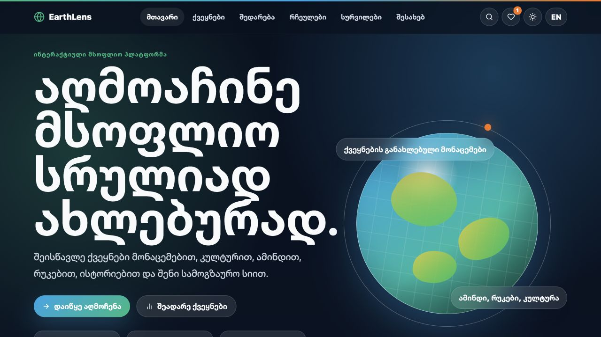
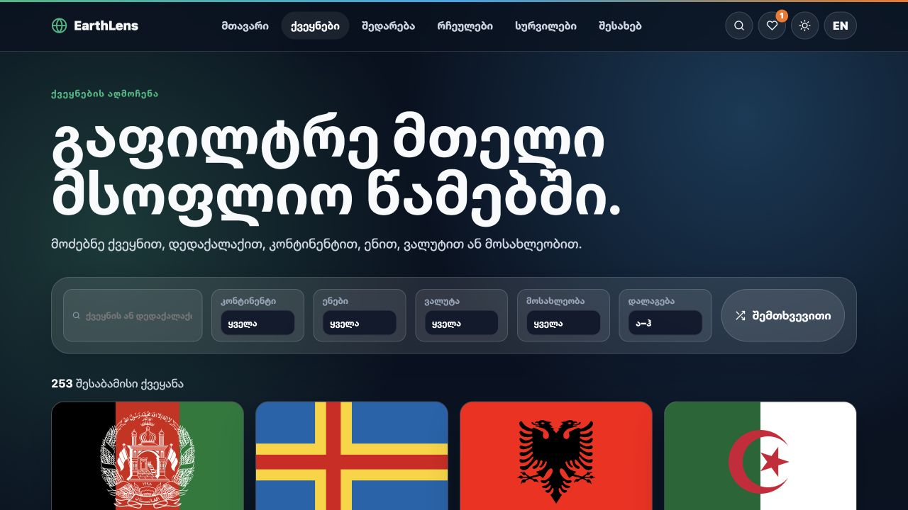
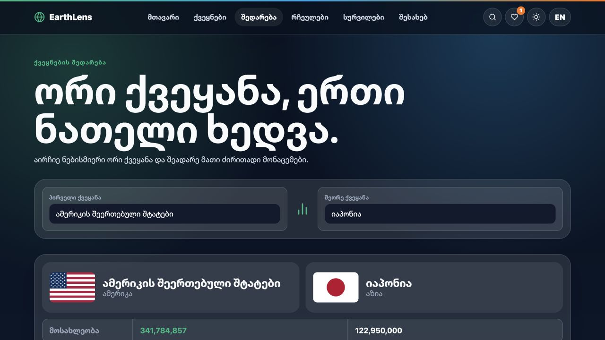

# EarthLens

**Discover the World Like Never Before.**

EarthLens is an immersive country discovery and travel-planning application. It brings together reliable country profiles, weather, maps, comparison tools, favorites, and a personal travel wishlist in one responsive bilingual experience.

## Highlights

- Explore 253 countries and territories with search, filters, sorting, and progressive loading
- View capitals, population, area, regions, languages, currencies, timezones, borders, flags, maps, and weather
- Compare any two countries in a consistent side-by-side view
- Save separate favorites and travel-wishlist collections
- Mark wishlist destinations as visited and track world progress
- Switch instantly between English and professionally localized Georgian
- Use dark or light mode with preferences saved on the device
- Open quick views, share country links, copy information, and browse recent destinations
- Continue using the complete country atlas even when an external service is unavailable

## Screenshots

### Home



### Explore Countries



### Compare Countries



## Data Sources

- **REST Countries v5**: the authenticated country dataset is synchronized into `src/assets/countries-v5.json`. Runtime browsing does not expose an API key and cannot fail because of provider-side browser restrictions.
- **Open-Meteo**: current weather for capital coordinates; no API key required.
- **Wikipedia REST API**: localized country summaries and imagery where available; no API key required.
- **Unicode CLDR**: accurate Georgian country, language, and currency names.

## Technology

- React 19 with functional components and hooks
- Vite
- React Router
- Axios
- Context API
- SCSS Modules and CSS custom properties
- Framer Motion
- i18next and react-i18next
- React Toastify
- React Icons
- LocalStorage and SessionStorage

## Project Structure

```text
src/
  api/             Shared HTTP clients
  assets/          Country atlas and visual assets
  components/      Reusable interface components
  constants/       Application constants
  context/         Global preferences and saved-country state
  hooks/           Reusable React hooks
  layouts/         Shared page layouts
  pages/           Route-level screens
  routes/          Router configuration
  services/        Country, weather, and Wikipedia services
  styles/          Global design system
  translations/    English and Georgian locale catalogs
  utils/           Formatting, localization, and storage helpers
```

## Local Development

Requirements:

- Node.js 20 or newer
- npm 10 or newer

```bash
npm install
npm run dev
```

Open `http://localhost:5173`.

No environment variables or API keys are required.

## Scripts

| Command           | Purpose                                          |
| ----------------- | ------------------------------------------------ |
| `npm run dev`     | Start the Vite development server                |
| `npm run build`   | Create the optimized production build in `dist/` |
| `npm run preview` | Preview the production build locally             |
| `npm run lint`    | Run ESLint across the project                    |

## Production Verification

```bash
npm run lint
npm run build
npm run preview
```

## Persistence And Privacy

Favorites, wishlist entries, visited destinations, theme, language, recent views, search history, and preferences are stored in the visitor's browser. EarthLens does not require an account and does not send saved travel lists to a server.

## Accessibility

EarthLens includes semantic navigation, descriptive controls, keyboard-accessible actions, responsive text wrapping, visible focus behavior, localized accessible labels, and reduced layout shift through stable card dimensions.

## Future Improvements

- Interactive map-based exploration
- Optional cloud synchronization
- Offline service-worker caching
- Country quiz and itinerary-building tools

## Developer

Designed and developed by Lasha Abrama.
